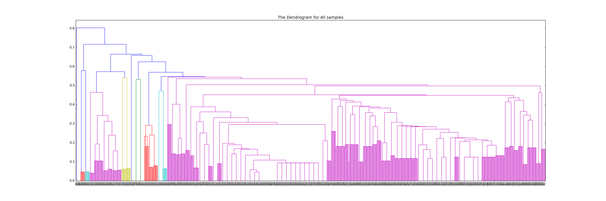

# Intro

In this assignment, we are analysing a number of samples to simulate a working Malware Classifier using Feautre hashing method for classification.

# Feature Extraction

In this step I have done the following:

- Copied the samples to a local folder, and make sure they are excecutable. 
- Developed a script to go over all of the sample arguments that are in `samples.json` and run strace, and output that to a seprate file. I called them `strace/(SAMPLE#).out_strace.

## Generating the Feature Set

- In here I basically lopped over all of the generated `strace` outputs, and then generated an n-gram model by taking system calls, and if there is a string inside the function. I take the syscall name  with the string inside. I thought this will make the features more useful in the classification phase. 
- When I add the instructions, I add them to a set to ensure I get unique elements.
- And here is an example: 

```
pattern = r'(\w+)\((.*(".*").*)?(.*)\)\s*=.*'
Outputs example:

write("../samples/0727: ")
execve("../samples/0033")
write("../samples/0183: ")
open("/home/wkr/devel/class/softvulnsec/prset07/coreutils/coreutils-8.23/../clang-O3/lib/charset.alias")
rt_sigaction()
connect("8.8.8.8")
clone()
kill()
getppid()
```
- At the end I end up in around 1700 instruction, this length will be used for constructing the Samples Feature Vectors.
- Before adding these to the Feature Set, I hashed them for feauture look up to get more efficient performance when I use the samples n-grams to lokup the common feautures list. 


## Feature Vector 
- I created a Bit Vector for each sample initialized as zeros, with length of =N, i.e. number of common feautures in the Common Feauture Set. Then I basically loop over all of the strace output files for each sample, and generate the n-gram and use that to search for a match in the Common Feauture set.
- The Feature Set is now with a fixed size, and whenever I find a match, I get it's index then set the bit with the found index on the Feature vector for that sample. By this way, If I have Feature Vector Sample 1= {0,1,0}  and common Feautre set ={read, write, close} then it basically means the used feauture on the sample is "write" only based on the identified feature vector. 


## Creating the Configuration File
- The configuration file contains a MATRIX of MxN, M=number of samples and N=length of commone feauture sets.
- Each line started with the sample name, to make sure the row is labeled correctly later.
- Then This file is parsed to my `cluter` script, and the Matrix is convertd to Numpy.NDArray to fit the used library tools of `scipy` that I am using. 

# Sample Clustering - using Scipy library

- After we get the configuration file, we are ready to perform the clustering script.

```
X = numpy.array(matrix)
D = (pdist(X, 'jaccard'))
Z = linkage(D, method='average')
```

- The scipy library provides easy-to-use methods to perform agglomerative hierarchical clustering on the given matrix. That is included in `scipy.cluster.heirarchy`.  It also has functions to perform variant distance algorithms.
- For `D`, So here we construct the Triangle Distance matrix using jaccard algorithm, which will perform the pairwise jaccard distance for all samples. 
- For `Z`, This will perform the agglomeramtive hierarcchical clustering, and construct the needed ND array that can be used for either constructing the dendrogram or coming up with flatten clusters, which I have done both.  I have used method='average' to when it calculates distance between two clusters.


## Selecting the threshold

- First way was to use direct eye-balling opservation on the generated dendrogram, and I also made another copy that is reduced (truncated_mode). 



- As you can see the pictures, first one is the overall without any reduction, and the second is reduced to increase visiblity. 
- I figure out the needed threshold in this case will be somewhere between `0.3` and `0.4`.
- So I made the script to accept the t as argument and perform several tests, and identify 1) how many clusters generated, and how many of the mare singleton clusters.  
- It turns out that there are some family samples that have very close distance, probably 400 or so, that always either split into three clusters or two clusters, and the rest of the clusters are kinda a number of samples that are classified in (8 samples, 16 samples, 24 samples or 60 samples).
- This was all based on trial and error and changing the threshold between 0.29 and 0.35, such as 0.3, 0.31, 0.32... It's interesting because in this area the differences are huge because as I mentioned there is huge part of the samples are kinda very close to each other and probably the other half are the ones that really have special features together. This made me think that probably half of them are just some samples you have used for a reason.
- The method I used to come up withe flatten clusters, is by using `fcluster` and I actually took a long time until I figure out the required function to get the cluster top nodes, which it turns out given by the function name `leaders`

## Fcluster and leaders() to get the Top of the clusters

- The fcluster basically takes `Z` and based on the used metric and threshold  it gives back a cluster numbers mapping to the original observation nodes.
- Tacking that output from fcluster and passing it to `leaders`, I get now a list of node id's that represent top of each produced cluster.
- By traversing-down through each leader node to to it's leaves, I get the sample labels out of the leave-nodes. 
- I am glad I still remember my Data structure skills to do the pre-order traveral over a tree. So I did these functions to get what I need

```
def search_id(node, id):
        if node.get_id() ==  id:
                return node

        found = None
        if node.left:
                found = search_id( node.left, id)
        if found == None:
                if node.right:
                        found =  search_id( node.right, id )

        return found

def get_children(node, children):
        if node.right:
                children.append(node.right)
                children.extend(get_children(node.right, []))
        if node.left:
                children.append(node.left)
                children.extend(get_children(node.left, []))

        return children
```

- I start by getting the root node of the whole tree using `to_tree()` then in that leader nodes iteration, I use `search_id` then `get_children` then loop over children until reach `is_leaf()=true` then map the id of the leaf node to the label list which I maintain before hand.

# Sample Runs
```
Using t= 0.3  How many Clusters?= 47  Singleton= 0
Using t= 0.29  How many Clusters?= 56  Singleton= 8
Using t= 0.35  How many Clusters?= 37  Singleton= 0
```


# Challanges


## Scheduling Problem
- Some of the samples were doing an infinite loop which stuck my script. I spent a lot of time trying to solve this, but finally I have looked at the original source code of subprocess. Popen and made some changes where the threads that reads the output are  using join() so the code wait for them to finish reading. So I changed that to join(timeout=3) to just give it 3 seconds to finish, then I check for is_alive() and then terminate the process because I know the thread for reading got timout. 


## hashing 

I first when I design the config generation using python hash() which is used to hash for dictionary entries. It worked pretty good without no problems, I was just concerned if there is a collision will happen so I updated my code to use djb2 but I was surprised because:
 I got slightly different results than hash()  I could go over each entry and see the collision but here are the results
I keep using hash() now in my code since it got me an even balanced distrubution of the malware fingerprints.

```
with hash()
How many leaves we got? 824
{
 "clusters": [
  8, 
  24, 
  16, 
  8, 
  8, 
  8, 
  8, 
  8, 
  8, 
  8, 
  8, 
  16, 
  8, 
  24, 
  8, 
  192, 
  8, 
  8, 
  8, 
  8, 
  8, 
  8, 
  8, 
  16, 
  8, 
  8, 
  192, 
  16, 
  8, 
  8, 
  8, 
  8, 
  8, 
  8, 
  8, 
  8, 
  8, 
  8, 
  8, 
  8, 
  8, 
  8, 
  24, 
  8, 
  8, 
  8, 
  8
 ]
}
Using t= 0.3  How many Clusters?= 47  Singleton= 0


- with djb2()
How many leaves we got? 824
{
 "clusters": [
  8, 
  24, 
  16, 
  8, 
  8, 
  8, 
  8, 
  8, 
  21, 
  3, 
  8, 
  8, 
  8, 
  16, 
  8, 
  24, 
  8, 
  192, 
  8, 
  8, 
  8, 
  8, 
  8, 
  8, 
  8, 
  16, 
  8, 
  8, 
  192, 
  16, 
  8, 
  8, 
  8, 
  8, 
  8, 
  8, 
  8, 
  8, 
  8, 
  8, 
  8, 
  8, 
  8, 
  8, 
  8, 
  8, 
  8, 
  8
 ]
}


```
## Out of memory when a lot of Popen
- I managed to multiprocessing > Process for each instance of running the Popen subprocess one and it somehow it solved the issue.


## clustering
I spent most of my time trying to figure out what to do with fcluster() and dendrogram but I am glad I am able to do this assignment I have learned a lot about how these tools works and what is the idea of classification of ducuments in general using the feauture victors.


# Running my sciprts
- Running the cluster will prompt you to run generate_strace or not,  just hit enter because I have all of the generate strace files ready on a folder.
- When it prompts you for generate_strace, just hit enter. It's alreay generated unles if you want to see in action.

```
./clustering/cluster cluster_config 
./clustering/cluster cluster_config 0.35                      "use particular t"
./clustering/cluster cluster_config 0.35 reduce               "This show only number of samples per cluster"
```


## Other  Graphics 
- Here is some graphs that I did, I was illustrating the sub clusters alone to see ... 


- I have also done other graphics: 

# Update 
I did the extra co-clustering too. I really didn't notice it until today.  I also updated some things in my code, especially the regular expression to match the features more accurately. I noticed the previous one was matching all of the execve ones as a single feature for al samples. This is because my regular expression was matching the last string of the function.  It makes a lot more sense when I see the co-clustering now!


Example:
```
          "features": [
                "open(\"/lib/x86_64-linux-gnu/libc.so.6\")",
                "statfs(\"/dev\")",
                "exit_group()",
                "stat(\"/proc/sys\")",
                "read(\"\")",
                "stat(\"/home/spatialisotope\")",
                "stat(\"/proc/bus\")",
                "stat(\"/dev\")",
                "stat(\"/etc/resolv.conf\")",
                "mmap()",
                "statfs(\"/etc/hosts\")",
                "stat(\"/dev/mqueue\")",
                "statfs(\"/\")",
                "brk()",
                "stat(\"/proc/kcore\")",
                "close()",
                "uname(\"Linux\")",
                "stat(\"/dev/pts\")",
                "stat(\"/proc/irq\")",
                "write(\"Filesystem",
                "open(\"/etc/ld.so.cache\")",
                "munmap()",
                "statfs(\"/dev/shm\")",
                "read(\"/dev/vda9",
                "stat(\"/sys\")",
                "arch_prctl()",
                "stat(\"/dev/shm\")",
                "read(\"\\177ELF\\2\\1\\1\\0\\0\\0\\0\\0\\0\\0\\0\\0\\3\\0>\\0\\1\\0\\0\\0\\320\\37\\2\\0\\0\\0\\0\\0\")",
                "stat(\"/etc/hosts\")",
                "read(\"oc",
                "stat(\"/proc/sysrq-trigger\")",
                "mprotect()",
                "access(\"/etc/ld.so.preload\")",
                "statfs(\"/home/spatialisotope\")",
                "stat(\"/\")",
                "fstat()",
                "stat(\"/etc/hostname\")",
                "open(\"/etc/mtab\")",
                "stat(\"/proc\")",
                "access(\"/etc/ld.so.nohwcap\")"
            ],
            "samples": [
                [
                    "0566",
                    "0487",
                    "0469",
                    "0355",
                    "0259",
                    "0236",
                    "0227",
                    "0199"
                ]
            ]
        },

```
